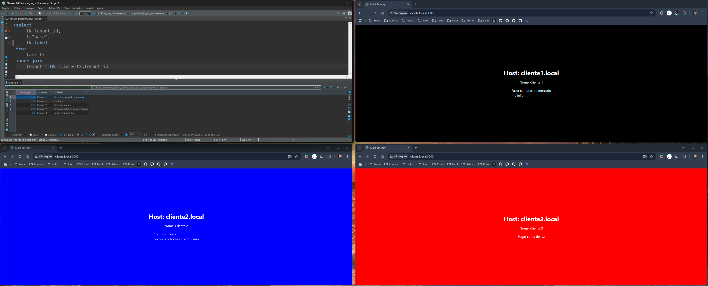

# To Do - Multi-Tenancy

## 📋 Sobre o projeto

O projeto consiste em um estudo prático simplificado da arquitetura Multi-Tenancy, com o objetivo de explorar como diferentes inquilinos podem compartilhar os mesmos recursos enquanto mantêm a segregação de dados.

<div align="center">
     
</div>

#

## 🚀 Tecnologias

As seguintes tecnologias foram utilizadas no desenvolvimento deste projeto:

- **TailwindCSS:** Framework de utilitários para estilização rápida e responsiva.

- **Next.js:** Framework React para renderização híbrida (SSR/SSG) e roteamento simplificado.

- **TypeScript:** Superset do JavaScript que adiciona tipagem estática ao código.

- **Prisma:** ORM que simplifica a manipulação de banco de dados e consultas.

- **PostgreSQL:** Sistema de banco de dados relacional avançado e robusto.

## 📦 Como executar o projeto

### Pré-requisitos

Antes de começar, você vai precisar ter instalado em sua máquina as seguintes ferramentas:
[Git](https://git-scm.com), [Node.js](https://nodejs.org/en/).

### Passo a passo

1. Clone o repositório:

   ```bash
   git clone https://github.com/hulysses/to-do-next-multi-tenency
   ```

2. Navegue até o diretório do projeto:

   ```bash
   cd to-do-next-multi-tenency
   ```

3. Execute o seguinte comando para baixar as dependências:

   ```bash
   npm i
   ```

4. Configure as variáveis de ambiente:

   Crie um arquivo .env na raiz do projeto e adicione as configurações necessárias. Você pode usar o arquivo .env.example como referência:
   ```bash
   cp .env.example .env
   ```
5. Configure as variáveis de ambiente:
    Antes de executar as migrações, exclua a pasta migrations e então crie as tabelas no banco de dados com o seguinte comando:
    ```bash
   npx prisma migrate dev
   ```
6. Inicie o servidor de desenvolvimento:
   ```bash
   npm run dev
   ```